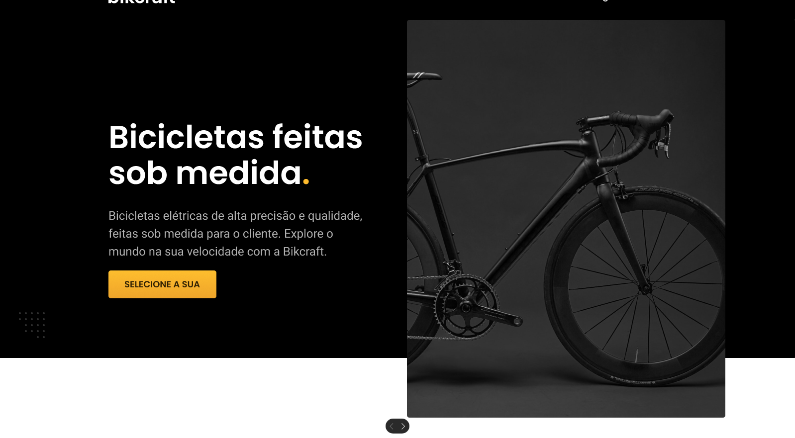
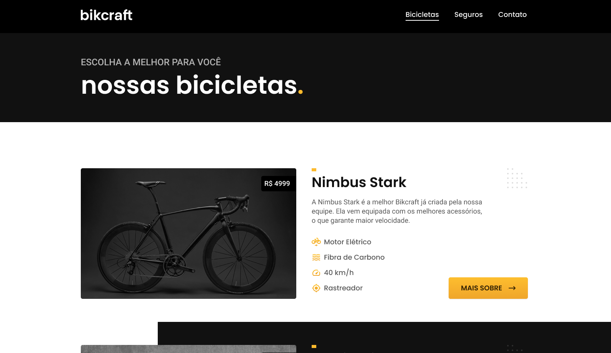
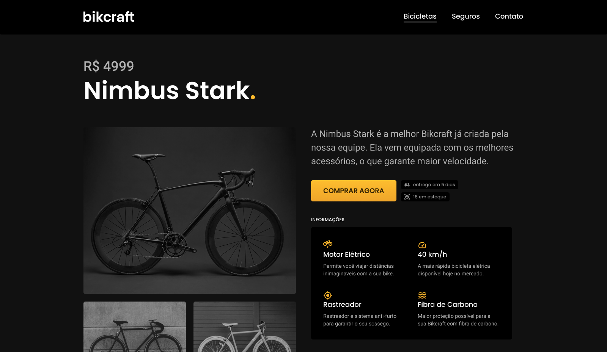
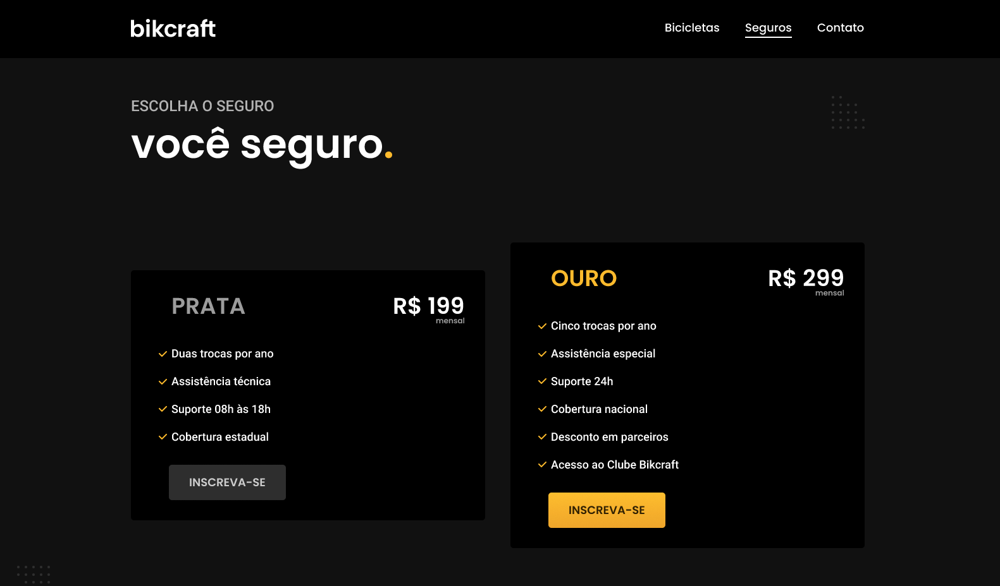
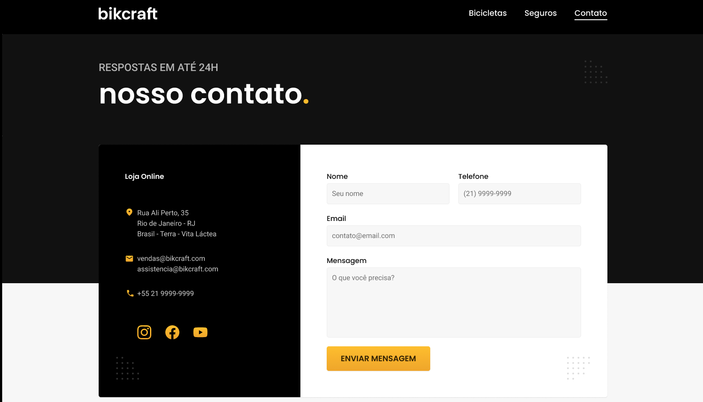
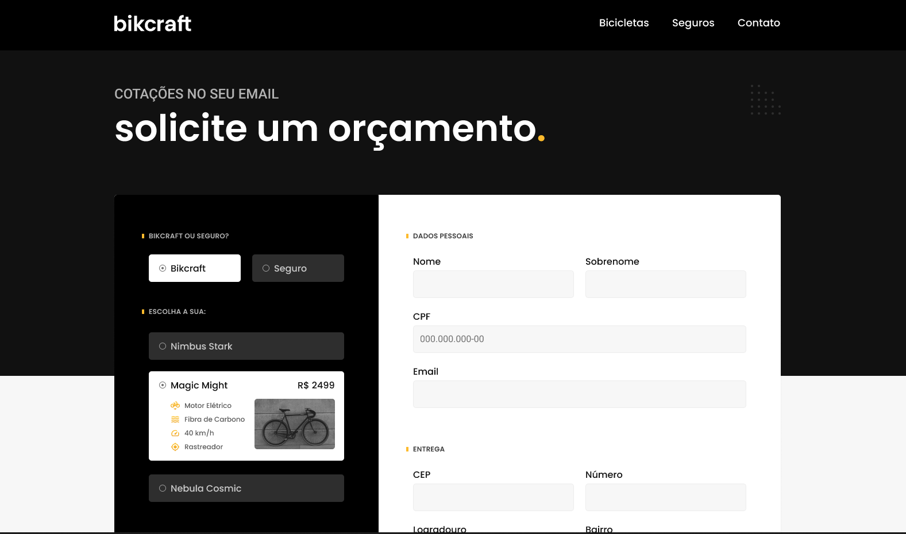
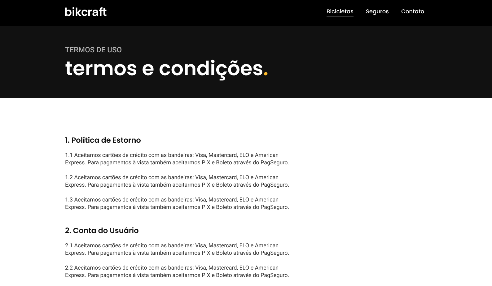

# Aplicação Bikcraft

### Curso Origamid - HTML5 e CSS3

Faaala dev!, seja bem-vindo. Este projeto é aplicação de um site de vendas de bikes fictício, onde apliquei conhecimentos avançados de HTML5 E CSS3, sem utilizar qualquer outra linguagem, site todo responsivo.

## <a href="https://renyzeraa.github.io/app-bikcraft/" > Deploy 🚀 </a>

### Para fazer este projeto usei 👇

  
  

## Contact

Made with ❤️ by [Renan L. Silva](https://github.com/renyzeraa)!  
🛠 Frontend Developer Jr.  
📍 Santa Catarina - Brazil  

&nbsp;
&nbsp;
&nbsp;
&nbsp;

 
